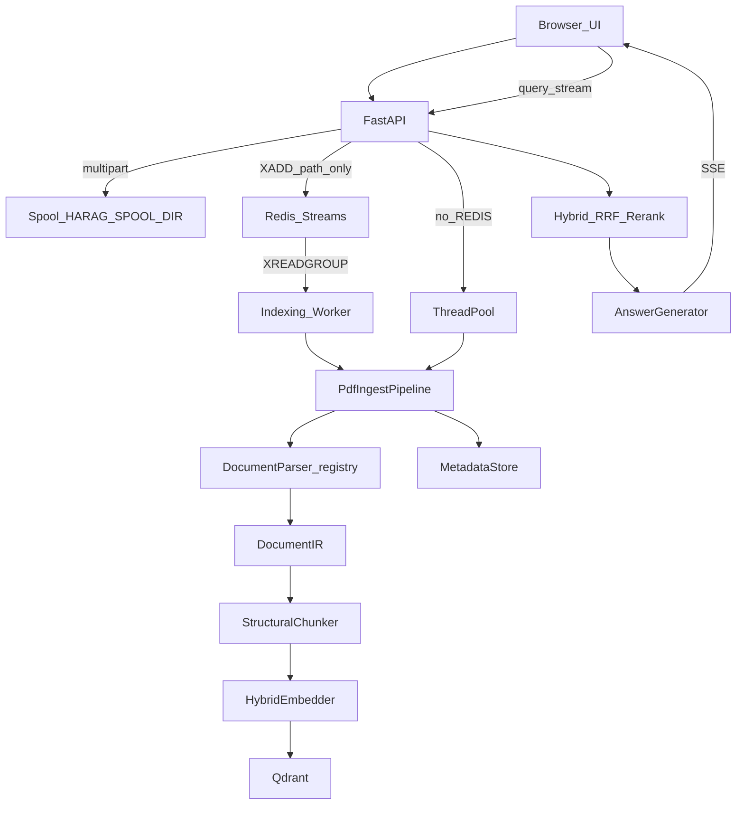

# 건강보험 설명 챗봇 (health-insurance-chatbot)

> 한글 행정·건강보험 문서를 올리고, **근거(출처)와 함께** 답하며, 근거가 없으면 **지어내지 않고 “모른다”고 답하는(abstain)** RAG 서비스  
> 내부 코드명: **harag** (한글 행정문서 RAG)

이 저장소는 엔터프라이즈 설계([MASTER_DESIGN](앞으로%20해야%20할%20것들/harag_project/docs/MASTER_DESIGN.md) 계열) 중 **「문서 업로드 → 파싱·청킹·임베딩 → 검색·생성 → 출처/거절」** 수직 슬라이스를 **실제로 돌아가는 MVP**로 구현한 결과물이다.  
대상 사용자는 데모 사용자뿐 아니라, 민원·안내 **창구 직원**이 고객 앞에서 규정 문서를 검색·인용하는 시나리오를 포함한다.

---

## 목차

1. [프로젝트 한눈에](#1-프로젝트-한눈에)
2. [목표와 비목표](#2-목표와-비목표)
3. [빠른 시작](#3-빠른-시작)
4. [기능 카탈로그](#4-기능-카탈로그)
5. [아키텍처](#5-아키텍처)
6. [데이터·API 계약](#6-데이터api-계약)
7. [설정·운영 포인트](#7-설정운영-포인트)
8. [프로그래밍 문제와 해결](#8-프로그래밍-문제와-해결) ← 개발 서사(장문)
9. [테스트·품질](#9-테스트품질)
10. [로드맵·관련 문서](#10-로드맵관련-문서)
11. [한계와 정직한 경계](#11-한계와-정직한-경계)
12. [기여](#12-기여)

---

## 1. 프로젝트 한눈에

### 한 줄 정의

사용자가 PDF·한글(HWPX/HWP)·Word(DOCX/DOC) 규정을 업로드하면, 시스템은 문서를 구조적으로 파싱·청킹한 뒤 벡터 검색과 LLM으로 **문서에 적힌 내용만** 요약·안내하고, 근거가 부족하면 답변을 보류한다.

### 왜 만들었는가

건강보험·여비·급여 등 **행정 규정**은 조문이 길고 표가 많으며, 일반 챗봇은 “그럴듯한 거짓말”을 하기 쉽다.  
이 프로젝트의 핵심 가치는 다음 세 가지다.

1. **근거 우선** — 답변에 출처(문서·페이지·조 경로·발췌)를 붙인다.
2. **거절 가능(abstain)** — 검색 점수 부족, 위조 인용, LLM 장애·비용 상한 등에서 **모른다고** 말한다.
3. **창구 사용성** — 면책 문구, 준비된 문서 없으면 질의 차단, 모바일 사이드바, JWT/세션 인증 UI.

### 무엇이 “돌아가는가” (현행)

| 영역 | 상태 |
|------|------|
| 문서 업로드·상태·삭제 | 동작 |
| PDF / HWPX / DOCX / HWP / DOC 파싱 | 동작(HWP 표는 제한·경고) |
| 구조 청킹·임베딩·Qdrant | 동작 |
| 하이브리드(dense+sparse RRF) | 신규 컬렉션에서 동작 |
| 질의 JSON / SSE 스트리밍 | 동작 |
| 구조화 인용(chunk_id·snippet) | 동작 |
| Redis Streams 인제스트 워커 | `REDIS_URL` 설정 시 동작 |
| 창구 UI(면책·인용 패널·중지) | `frontend/` 정적 서빙 |
| OCR(스캔 PDF) | **미구현** — 명확한 실패 메시지만 |
| 바이너리 HWP 표 완전 복원 | **제한** — [ADR-HWP5](docs/adr/ADR-HWP5.md) |

키(임베딩/LLM)가 없어도 **로컬 폴백**(결정적 해시 임베딩 + 추출형 답변)으로 데모가 된다. 키를 넣으면 운영 품질 경로로 전환된다.

---

## 2. 목표와 비목표

### 목표

- **정확도:** 업로드한 문서에 근거한 답변. 골드셋·실 API 평가로 hit@k·abstention을 검증할 수 있는 구조.
- **신뢰:** 출처를 사용자가 열어볼 수 있고, 근거 없으면 답하지 않는다.
- **운영 가능 MVP:** Docker Compose로 Qdrant·Redis·API·워커를 올리고, Qdrant Cloud/Gemini 등 외부 서비스와 조합 가능.
- **포맷 현실성:** 행정이 쓰는 PDF뿐 아니라 HWPX·HWP·Word까지 **같은 청킹·검색 파이프라인**으로 넣는다.
- **다중 사용자 기초:** 소유자(`owner:`) ACL로 문서 격리. JWT 시크릿이 있으면 Bearer 검증.

### 비목표 (의도적으로 하지 않는 것)

- 개별 민원 사안에 대한 **법률 판단·확정 안내** (“당신 케이스는 이렇게 처리되어야 한다”).
- 문서 공동 편집, 실시간 협업.
- Kafka/MSA로 파싱·임베딩을 완전 분리한 마이크로서비스(현행은 FastAPI + 선택 Redis 워커).
- 클라우드 OCR / VLM으로 스캔·차트 전면 해석.
- 한컴 상용 SDK 필수 의존.

창구 UI 상단 면책: *「문서 검색·요약 도구이며, 개별 사례의 법적 판단·확정 안내가 아닙니다.」*

---

## 3. 빠른 시작

### 3.1 Docker Compose (권장)

```bash
cp .env.example .env      # (선택) LLM/임베딩/Qdrant 키. 비워두면 로컬 폴백
docker compose up --build
# 브라우저: http://localhost:8000
# 문서 업로드 → 상태「준비됨」→ 질문
```

Compose는 기본적으로 `redis`, `qdrant`, `api`, `worker`를 기동한다.

- `REDIS_URL`이 켜져 있으면 **워커가 인덱싱**한다. API만 띄우면 문서가 `processing`에 남을 수 있다.
- API와 워커는 **`HARAG_SPOOL_DIR`**(compose: `/app/spool`)을 공유해야 한다. Redis만 켠 채 로컬 tempfile을 쓰면 워커가 파일을 못 본다.
- `.doc` 변환용 LibreOffice는 API/워커 이미지에 포함된다(`ENABLE_DOC_CONVERT`).

### 3.2 Gemini(Google AI Studio) 예시

과금·쿼터 운영은 [docs/GEMINI_COST_STRATEGY.md](docs/GEMINI_COST_STRATEGY.md)를 본다.

```dotenv
LLM_API_BASE=https://generativelanguage.googleapis.com/v1beta/openai
LLM_API_KEY=...
LLM_MODEL=gemini-flash-latest
LLM_REWRITE_MODEL=gemini-flash-lite-latest
EMBEDDING_API_BASE=https://generativelanguage.googleapis.com/v1beta/openai
EMBEDDING_API_KEY=...
EMBEDDING_MODEL=gemini-embedding-001
EMBEDDING_DIM=768
EMBEDDING_SEND_DIMENSIONS=true
RATE_LIMIT_QPM=5
```

OpenAI 호환이면 `*_API_BASE` / `*_MODEL`만 바꿔 끼운다(예: Upstage Solar).

> 임베딩 차원·모델을 바꾸면 기존 Qdrant 컬렉션과 어긋난다. 컬렉션을 삭제하거나 `QDRANT_COLLECTION`을 새 이름으로 바꾼 뒤 재인덱싱한다.

### 3.3 로컬 (Docker 없이)

Python 3.11+ 권장.

```bash
python -m venv .venv && source .venv/bin/activate
pip install -e .
# QDRANT_URL 비우면 인메모리 Qdrant(:memory:)
# REDIS_URL 비우면 인프로세스 ThreadPool 인제스트(워커 불필요)
uvicorn harag.api.main:app --reload --app-dir src
# http://localhost:8000
```

Redis를 쓰려면:

```bash
docker compose up -d redis qdrant
export REDIS_URL=redis://localhost:6379/0
export HARAG_SPOOL_DIR=/tmp/harag_spool
mkdir -p "$HARAG_SPOOL_DIR"
# 터미널 1: uvicorn …
# 터미널 2: python -m harag.indexing.run_worker
```

### 3.4 스모크 테스트

```bash
pip install httpx
BASE=http://localhost:8000 python scripts/smoke.py
```

전체 단위/행위 테스트:

```bash
pip install -e ".[dev]"
pytest -q
```

포맷 게이트(표본 파일 경로):

```bash
python scripts/poc_format_gate.py sample.docx sample.hwpx
```

---

## 4. 기능 카탈로그

### 4.1 문서 인제스트

| 확장자 | 경로 | 비고 |
|--------|------|------|
| `.pdf` | `PdfParser` (pdfplumber) | 다단·노이즈·조항 `struct_path` |
| `.hwpx` | `HwpxDecoder` + `StructuringParser` | ZIP+XML, 표 셀 보존 |
| `.docx` | `DocxDecoder` + `StructuringParser` | python-docx |
| `.hwp` | `Hwp5Decoder` (olefile PrvText 등) | 본문 검색 가능, **표 제한 경고** |
| `.doc` | LibreOffice → DOCX → DocxDecoder | `ENABLE_DOC_CONVERT`, 로컬만 |

업로드 API는 스풀에 저장한 뒤(경로만 Redis에 실음) 워커 또는 ThreadPool이 파싱→청킹→임베딩→Qdrant→MetadataStore 상태를 갱신한다.  
PDF **바이트를 Redis에 넣지 않는다.**

실패 코드 예: `scan_pdf_no_ocr`, `encrypted_pdf`, `hwp5_parse_failed`, `docx_parse_failed`, `doc_convert_failed`, `capacity_exceeded`.  
HWP 표 미복원 시에도 검색은 가능하게 `ready` + `hwp5_table_limited` 경고를 남긴다.

### 4.2 파싱·청킹

- **IR(`DocumentIR`):** 블록 타입, `struct_path`, 표 셀, `parse_quality`, fail-closed 불변식.
- **청킹:** 포맷 무관(IR만 본다). 장>조 상속, 표 Markdown 직렬화, max 500 / overlap 50 토큰 윈도우, (API 임베딩 시) 의미 분할.
- **디코드≠구조화:** `HwpDecoder` Protocol → `RawBlock` → `StructuringParser`. PDF만 전용 파서가 IR을 직접 만든다.

### 4.3 검색·생성

- **하이브리드:** dense + sparse(형태소 또는 어절) RRF. 옛 dense-only 컬렉션은 dense 폴백.
- **리랭크:** LLM pointwise / TEI HTTP CE / Lexical 폴백. 부하 시 under_load 스킵 가능.
- **멀티턴 재작성:** `conversation_id` + 대화 이력(Redis 또는 인메모리). “그건 언제까지?” 해소.
- **생성:** 인용 마커(`[문서 N]`) 검증, 비용·재시도 가드, abstain 사유 코드.
- **스트리밍:** SSE `token` / `citations`(JSON 배열) / `abstain` / `done` / `error`.

### 4.4 Redis (선택)

`REDIS_URL`이 있으면:

- 인제스트: Streams (`XADD`/`XREADGROUP`/`XACK`/`XAUTOCLAIM`) + Lua 원자 enqueue  
- 문서 상태 캐시 TTL 300s  
- 레이트제한 Lua 토큰버킷  
- 대화 이력 pipeline  

없으면 전부 인메모리/ThreadPool 폴백. 상세는 [docs/REDIS_DESIGN.md](docs/REDIS_DESIGN.md).

### 4.5 보안·격리·용량

- `X-Owner-Id` 또는 JWT `sub` → `owner:{id}` ACL 태그. 본인 문서만 검색·삭제.
- 프롬프트 인젝션 완화(`security/injection.py`).
- Qdrant 디스크 예산(`QDRANT_DISK_BUDGET_MB`) — 초과 시 인덱싱 거부. `/health`에 capacity 노출, UI 배너.

### 4.6 창구 UI (`frontend/`)

- 브랜드·면책·빈 문서 안내·ready 가드  
- 업로드 busy, 실패 사유 본문 표시, 용량 경고  
- 인용 칩 → 출처 패널(문서·페이지·조·snippet)  
- 스트리밍 중지(AbortController)  
- JWT 붙여넣기 / 데모 세션  
- 모바일 사이드바  

사용법: [docs/COUNTER_UX.md](docs/COUNTER_UX.md).  
제품 백로그: [docs/COUNTER_PRODUCT_BACKLOG.md](docs/COUNTER_PRODUCT_BACKLOG.md).

---

## 5. 아키텍처

### 5.1 엔드투엔드 흐름



### 5.2 주요 디렉터리

```
src/harag/
  config/settings.py       환경변수 → Settings
  schemas/                 IR·청크 Pydantic 계약
  contracts/               경계 타입·검증(verify_boundary*)
  parsing/                 PdfParser, Hwpx/Docx/Hwp5Decoder, ConvertService, DocumentParser
  chunking/chunker.py      구조·의미 청킹
  embedding/               API/로컬 + HybridEmbedder
  retrieval/               QdrantStore, reranker, rewriter, context_compact
  generation/              생성·인용 추출·abstain
  llm/                     OpenAI 호환 transport, 리랭크, 팩토리
  indexing/                pdf_pipeline, run_worker, versioning(라이브러리)
  storage/                 redis_*, metadata_store, object_store(인터페이스)
  api/                     라우트·미들웨어·인증·조립(main)
  security/                injection, pii
  eval/                    harness, poc, quality …
frontend/                  창구 UI
docs/                      Redis, 창구 UX, Gemini, ADR-HWP5, 정확도 메모
scripts/                   smoke, eval, poc_format_gate, …
tests/behavior|contract/   행위·계약 테스트
```

### 5.3 설계 원칙 (코드에 녹인 것)

1. **어댑터 뒤 실물** — LLM/임베딩/Qdrant/Redis를 인터페이스 뒤에 두고, 없으면 폴백.
2. **경계 fail-closed** — 빈 `acl_tags`는 “공개”가 아니라 인덱싱 거부.
3. **디코드와 구조화 분리** — 어려운 포맷 디코더만 갈아끼운다.
4. **경로만 큐잉** — 대용량 PDF를 브로커에 넣지 않는다.
5. **포맷별 Go/No-Go** — HWP 표가 약해도 DOCX·PDF 출시를 막지 않는다.

---

## 6. 데이터·API 계약

### 6.1 내부 모델

- **DocumentIR:** 파서 출력. `parse_status`, `blocks[]`, `parse_quality`(char_count, table_recovery_avg…).
- **Chunk + ChunkMetadata:** `chunk_id`, `struct_path`, `citation_label`, `acl_tags`, `page_ref`, `source_document` 등.
- **ScoredChunk:** 검색 결과 + score → 생성·인용에 전달.

### 6.2 HTTP API

| 메서드 | 경로 | 설명 |
|--------|------|------|
| POST | `/v1/documents` | multipart 업로드. 202 + `document_id` (`accepted`/`duplicate`) |
| GET | `/v1/documents` | 내 문서 목록 |
| GET | `/v1/documents/{id}` | 상태 폴링 |
| DELETE | `/v1/documents/{id}` | 삭제(처리 중이면 409) |
| POST | `/v1/query` | JSON 답변 + `citations[]` |
| POST | `/v1/query/stream` | SSE |
| GET | `/health` | `status`, 선택 `capacity`, `redis` 통계 |

**Citation 필드(현행):** `citation_label`, `source_document`, `page`, `chunk_id`, `struct_path`, `snippet`.

**인증:** 기본 `X-Owner-Id`. `AUTH_JWT_SECRET` 설정 시 Bearer JWT 필수(`sub` → user_id).

**레이트리밋:** `RATE_LIMIT_QPM`(owner별). Redis 있으면 공유 버킷.

---

## 7. 설정·운영 포인트

`.env.example`이 정본에 가깝다. 자주 쓰는 항목만 요약한다.

| 변수 | 의미 |
|------|------|
| `LLM_*` / `EMBEDDING_*` | 생성·임베딩. 비면 로컬 폴백 |
| `QDRANT_URL` / `QDRANT_API_KEY` / `QDRANT_COLLECTION` | 벡터 DB |
| `QDRANT_DISK_BUDGET_MB` | 디스크 예산 가드 |
| `REDIS_URL` / `HARAG_SPOOL_DIR` | 큐+워커. **둘 다 맞출 것** |
| `REDIS_KEY_PREFIX` 등 | Streams trim, visibility, max attempts |
| `PARSE_MIN_TABLE_RECOVERY` | HWP 표 경고 임계 |
| `ENABLE_DOC_CONVERT` / `LIBREOFFICE_BIN` | `.doc` 변환 |
| `AUTH_JWT_*` | JWT 모드 |
| `DATABASE_URL` | SQLite 기본 / Postgres 선택 |
| `RATE_LIMIT_QPM` | 분당 요청 |

운영 체크리스트:

1. 파서·청커 버전을 올리면 **기존 문서는 재업로드**.
2. Redis 모드에서는 **worker 프로세스 필수**.
3. Qdrant 무료 티어는 한도 초과 시 과금이 아니라 **장애** — `/health`·대시보드 모니터링.
4. 행정문서를 외부 LLM에 보내는 것은 **법무·약관** 확인 대상이다(학습 비사용 등).

남은 사용자 구축 vs 코드 잔여: [REMAINING_WORK.md](REMAINING_WORK.md).

---

## 8. 프로그래밍 문제와 해결

이 섹션은 “무엇을 만들었는가”가 아니라 **막혔던 지점과 결정**을 남긴다.  
각 항목은 **문제 → 원인 → 해결 → 교훈** 형식이다.

### 8.1 Redis LIST + BRPOP = 작업 유실

**문제.**  
초기 인제스트 큐는 Redis LIST에 `LPUSH`하고 워커가 `BRPOP`으로 꺼냈다. 워커가 파싱 도중 크래시하면 메시지는 이미 리스트에서 사라져 **작업과 스풀이 유실**되었다(at-most-once).

**원인.**  
`BRPOP`은 꺼내는 순간 큐에서 삭제한다. “처리 중” 상태가 브로커에 없다.

**해결.**  
Redis Streams + consumer group으로 바꿨다. `XREADGROUP`으로 읽고, 성공 시 `XACK`, 장시간 idle은 `XAUTOCLAIM`으로 reclaim. enqueue는 Lua로 in-flight SET과 `XADD`를 원자화했다. 재시도 상한 후 DLQ 스트림(`MAXLEN ~ 1000`).

**교훈.**  
“큐에 넣었다”와 “처리했다”를 같은 연산으로 묶지 말 것. 경로만 큐잉하더라도 **ack 경계**는 필요하다.

---

### 8.2 failed 이후에도 seen/inflight가 남아 재업로드가 막힘

**문제.**  
MetadataStore는 `failed` → 재등록을 허용하는데, Redis `seen`/inflight SET이 남아 enqueue가 거절되고 API가 스풀 파일을 지워 버렸다. 사용자는 “다시 올렸는데 사라짐”을 겪었다.

**원인.**  
성공 경로에만 SET 해제 로직이 있고, 파이프라인 `_fail()`과 정합되지 않았다. “duplicate”와 “재시도”를 구분하지 않았다.

**해결.**  
`PdfIngestPipeline`에 `on_failed` 콜백을 주입해 in-flight를 반드시 해제. `InProcessIngest.submit`은 enqueue 거절 시 clear 후 1회 재시도하고, 이미 `ready`인 경우만 스풀을 삭제한다.

**교훈.**  
멱등 키와 **생명주기(실패·성공·재시도)** 를 같이 설계해야 한다. DB 상태와 큐 상태가 어긋나면 UX가 가장 먼저 깨진다.

---

### 8.3 Redis 연결 실패를 영원히 캐시

**문제.**  
`get_redis`가 실패를 `lru_cache`에 넣어, Redis가 잠시 죽었다가 살아도 **프로세스 재시작 전까지 Redis가 영구 off**였다.

**원인.**  
성공/실패를 같은 캐시 슬롯에 “영구”로 저장.

**해결.**  
성공 클라이언트만 길게 재사용하고, 실패는 URL별 **negative cache TTL(약 30초)** 후 재시도.

**교훈.**  
인프라 클라이언트의 실패 캐시는 TTL이 있는 “회로 차단기”여야 한다.

---

### 8.4 레이트제한 RMW 레이스

**문제.**  
토큰버킷을 `HGETALL` → 계산 → `HSET`으로 구현하면 동시 요청에서 **over-admit**이 난다.

**해결.**  
refill + consume + `EXPIRE`를 **단일 Lua EVAL**로 원자화. 대화 이력은 `RPUSH`+`LTRIM`+`EXPIRE`를 pipeline으로 한 RTT에.

**교훈.**  
공유 카운터는 “읽기-수정-쓰기”를 애플리케이션에 두지 말 것.

---

### 8.5 스풀 경로가 API와 워커에서 서로 다름

**문제.**  
API가 OS tempfile에 PDF를 쓰고 Redis에는 그 경로만 넣었는데, 워커 컨테이너는 그 경로를 볼 수 없어 `spool_read_failed`가 났다.

**해결.**  
`HARAG_SPOOL_DIR` 공유 볼륨을 강제. `REDIS_URL`이 있는데 스풀 디렉터리가 없으면 API는 **fail-fast**, 워커도 기동을 거부.

**교훈.**  
분산 워커에서 “파일 경로를 메시지에 넣는” 설계는 **공유 파일시스템 계약**이 전제다. 문서화만으로는 부족하고 기동 시 검사해야 한다.

---

### 8.6 PDF 다단 레이아웃과 헤더/푸터 오염

**문제.**  
y좌표만으로 줄을 정렬하면 2단 규정에서 열이 섞여 읽힌다. 반복 헤더·페이지 번호가 본문 청크에 들어가 검색 노이즈가 된다.

**해결.**  
줄 bbox의 x-gap 클러스터링으로 열을 나누고 왼쪽→오른쪽, 열 안 위→아래로 읽는다. 상·하 밴드 반복 텍스트와 페이지 번호 패턴을 `header_footer` + `is_noise`로 마킹해 청킹에서 스킵.

**교훈.**  
RAG 정확도는 “임베딩 모델”만이 아니라 **읽기 순서와 노이즈 제거**에서 크게 갈린다.

---

### 8.7 청킹에서 장·조 맥락과 표 구조 손실

**문제.**  
조 단위 flat `struct_path`와 한 줄 표 직렬화는 “제3장 아래 제12조” 맥락과 표의 행렬 관계를 검색·생성에 못 넘긴다.

**해결.**  
chapter 스택 상속(`제3장 > 제12조`), 청크 앞 구조 프리픽스, `parent_chunk_id`, 표를 Markdown 표로 직렬화, 토큰 슬라이딩 윈도우(500/50), API 임베딩 시 의미 분할.

**교훈.**  
청킹은 “토큰 길이” 문제가 아니라 **법률·행정 문서의 계층을 임베딩에 실어 주는 설계**다.

---

### 8.8 “출처”가 검색 청크 나열에 불과함

**문제.**  
LLM이 `citations=[]`를 자주 반환해, UI는 검색으로 뽑힌 청크 라벨을 `;`로 이어 붙였다. 사용자가 신뢰하기 어렵고, 스트림도 구조화되지 않았다.

**해결.**  
답변의 `[문서 N]` 마커로 `chunk_id`를 추출해 필터링(없으면 검색 청크 폴백). API `Citation`에 `chunk_id`/`struct_path`/`snippet` 추가. SSE `citations`를 **JSON 배열**로 전송. UI 칩 클릭 시 출처 패널.

**교훈.**  
인용은 “라벨 문자열”이 아니라 **검증 가능한 ID와 발췌**가 있어야 제품한다.

---

### 8.9 Gemini 무료 티어 쿼터·비용 폭발

**문제.**  
질의마다 임베딩 + (재작성) + (리랭크) + 생성으로 콜이 쌓여 RPM·비용을 초과하면 `llm_unavailable`이 빈발한다.

**해결.**  
재작성/리랭크 모델 분리·토글, 요청당 비용 상한·재시도 제한, `RATE_LIMIT_QPM` 하향, 컨텍스트 compact/dedupe, under_load 시 리랭크 스킵. 운영 가이드를 문서로 분리.

**교훈.**  
“정확도를 위한 추가 LLM 콜”은 **제품 SLO와 쿼터**와 함께 설계해야 한다. 끌 수 있는 스위치가 필요하다.

---

### 8.10 Qdrant 무료 클러스터 디스크 한도

**문제.**  
무료 티어는 자동 업그레이드가 없고, 디스크를 넘기면 과금이 아니라 적재 실패다. 재업로드 시 고아 포인트가 쌓일 수 있다.

**해결.**  
`ensure_capacity_for` / disk budget, 임베딩 차원 축소 옵션, `replace_document`로 재인덱싱 시 문서 단위 교체, `/health` capacity와 UI 경고.

**교훈.**  
벡터 DB “무료”는 **용량 가드가 제품 기능**이다.

---

### 8.11 HWP가 SPOF

**문제.**  
행정 문서는 `.hwp`가 많다. 바이너리 HWP5는 OLE·레코드 구조라 표 셀 복원이 어렵고, 라이브러리 품질이 들쭉날쭉하다.

**해결.**  
HWPX를 1등 시민으로(이미 ZIP+XML 디코더). HWP5는 olefile 기반 **텍스트 B1**으로 검색 가능하게 하고, 표 미복원 시 partial+경고로 HWPX 변환을 권고. LibreOffice로 HWP→PDF 우회는 품질·한글 이슈로 채택하지 않음. 결정은 [ADR-HWP5](docs/adr/ADR-HWP5.md).

**교훈.**  
포맷 전략은 “다 완벽하게”가 아니라 **포맷별 Go/No-Go로 출시를 분리**하는 것이다.

---

### 8.12 Word `.doc`와 데이터 주권

**문제.**  
구형 `.doc`는 python-docx로 직접 열리지 않는다. 클라우드 변환 API는 행정문서 반출 리스크가 있다.

**해결.**  
컨테이너에 LibreOffice writer를 넣고 **로컬 headless 변환**만 허용. 동시 변환 세마포어 1, 타임아웃, 매크로 비활성 플래그. 끄려면 `ENABLE_DOC_CONVERT=false`.

**교훈.**  
변환도 파이프라인의 일부이며, **어디선 실행되는가**가 보안 요구사항이다.

---

### 8.13 스캔 PDF와 OCR 기대 격차

**문제.**  
스캔본을 올리면 텍스트가 0인데, 예전 메시지는 “스캔/암호일 수 있음” 정도로 모호했다. 사용자는 OCR이 있는 줄 안다.

**해결.**  
페이지는 있으나 추출 텍스트가 없으면 `scan_pdf_no_ocr`, 암호/열기 실패면 `encrypted_pdf`로 구분. UI에 “OCR 미지원 — 텍스트 PDF로 재업로드”를 명시. OCR 엔진은 의도적 비범위.

**교훈.**  
기능을 안 만들 때도 **기대치를 깨는 메시지**는 제품 품질이다.

---

### 8.14 소유자 격리와 “데모 로그인”

**문제.**  
MVP에 회원가입을 넣기 전에 다중 사용자 문서를 섞으면 안 된다. 동시에 기관 JWT도 대비해야 한다.

**해결.**  
데모는 브라우저 UUID → `X-Owner-Id` → `owner:` 태그. `AUTH_JWT_SECRET`이 있으면 fail-closed Bearer. 프론트에 토큰 붙여넣기 UI. IdP OIDC 자체는 사용자 구축.

**교훈.**  
인증 UX와 ACL 태그를 처음부터 같은 모델(`AuthContext`)로 맞추면 Phase 2 IdP 연결이 수월하다.

---

### 8.15 창구 UX: “문서 없는데 질문 가능”

**문제.**  
기술적으로는 빈 인덱스에 질의해도 abstain이지만, 창구 직원에게는 혼란과 불필요한 API 비용이다.

**해결.**  
ready 문서 0이면 composer 비활성, 빈 목록 카피, 업로드/용량/면책, 인용 패널, 중지 버튼, 모바일 오버레이 사이드바.

**교훈.**  
RAG 제품의 UX는 채팅창이 아니라 **문서 준비 상태 머신**이다.

---

### 8.16 기타 (짧게)

| 이슈 | 대응 |
|------|------|
| sparse 해시 비결정성 | blake2b 등 결정적 해싱으로 인덱스 일치 |
| 인메모리만 쓰던 원문 | Qdrant payload에 저장·복원 |
| 브로커 없이 MSA 강요 | Kafka 대신 Redis Streams로 “읽기/쓰기 격리”만 확보 |
| 설계 폴더 난립 | 한국어 스냅샷 폴더는 아카이브, 런타임은 `src/harag`만 |

---

## 9. 테스트·품질

```bash
pytest -q
# tests/behavior — 리랭크, 재작성, Redis Streams, 포맷 디코더, 용량, 파이프라인 복원력 …
# tests/contract — ACL, capacity, eval 불변식 등
```

- **정확도 실험:** `scripts/eval_accuracy.py`, `docs/ACCURACY_REDIS_WORKER.md`, `eval_results/`.
- **포맷 게이트:** `scripts/poc_format_gate.py`.
- **스모크:** `scripts/smoke.py`.

품질 철학: 계약 테스트로 **불변식**을 고정하고, 행위 테스트로 **사용자 관찰 가능 동작**을 고정한다. 외부 API가 없는 CI에서도 로컬 폴백으로 핵심 경로가 초록이어야 한다.

---

## 10. 로드맵·관련 문서

| 문서 | 내용 |
|------|------|
| [REMAINING_WORK.md](REMAINING_WORK.md) | 사용자 구축 vs 코드 잔여 우선순위 |
| [앞으로 해야 할 것들/PRODUCTION_ROADMAP.md](앞으로%20해야%20할%20것들/PRODUCTION_ROADMAP.md) | 서비스화 로드맵 |
| [docs/REDIS_DESIGN.md](docs/REDIS_DESIGN.md) | Streams·키·재시도 |
| [docs/COUNTER_UX.md](docs/COUNTER_UX.md) | 창구 사용·포맷 정책 |
| [docs/COUNTER_PRODUCT_BACKLOG.md](docs/COUNTER_PRODUCT_BACKLOG.md) | 창구 JTBD·P0–P2·스프린트 티켓 |
| [docs/adr/ADR-HWP5.md](docs/adr/ADR-HWP5.md) | HWP5 결정 기록 |
| [docs/GEMINI_COST_STRATEGY.md](docs/GEMINI_COST_STRATEGY.md) | Gemini 쿼터·비용 |
| [docs/ACCURACY_REDIS_WORKER.md](docs/ACCURACY_REDIS_WORKER.md) | 정확도+워커 구현 메모 |
| [docs/실행_가이드.md](docs/실행_가이드.md) | 실행 절차 |

시스템 고도화(품질 게이트·PII·query audit·Object Store·OIDC·K8s 골격)는
[docs/SYSTEM_ADVANCEMENT.md](docs/SYSTEM_ADVANCEMENT.md) · [REMAINING_WORK.md](REMAINING_WORK.md)를 본다.
운영 잔여: 실문서 골드셋 라벨링, 상용 OCR(스캔 비율 게이트 후), IdP 실연동.

---

## 11. 한계와 정직한 경계

- 스캔 PDF는 OCR 없이 실패한다.  
- HWP 표·복잡한 컨트롤은 제한적이다. 가능하면 HWPX.  
- `.doc`는 LibreOffice가 있는 환경에서만.  
- 로컬 해시 임베딩·추출형 LLM은 **데모용**이다.  
- 하이브리드는 **sparse가 포함된 새 컬렉션**에서 의미가 있다.  
- 이 도구는 법률 자문이 아니다.

---

## 12. 기여

이슈·PR은 저장소 관례를 따른다. 변경 시:

1. `pytest -q`가 통과하는지 확인한다.  
2. 파서·청커 버전을 바꾸면 README/REMAINING_WORK와 재업로드 필요성을 언급한다.  
3. Redis·스풀·포맷 allowlist처럼 **운영 계약**을 바꾸면 `.env.example`과 docs를 함께 고친다.

질문이 “이 RAG가 무엇을 약속하는가”라면 답은 간단하다.  
**문서에 있는 말만, 출처와 함께, 없으면 모른다고 말한다.** 그 약속을 지키기 위해 파싱·큐·인용·쿼터·UX에서 위의 문제들을 하나씩 메웠다.
