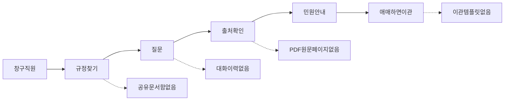

# 창구 사용자 제품 백로그 (IT 기획)

> 창구 직원 JTBD 기준 P0–P2. 엔지니어 인프라 순서가 아니라 **일과 막힘 제거** 순서로 정렬한다.  
> 사용 가이드: [`COUNTER_UX.md`](COUNTER_UX.md) · 엔지니어 잔여: [`../REMAINING_WORK.md`](../REMAINING_WORK.md) · 고도화: [`SYSTEM_ADVANCEMENT.md`](SYSTEM_ADVANCEMENT.md)

**상태**: 기획 합의 문서 (2026-07-17). **스프린트 A(A1–A3) 구현 반영** (오류 코드·공유 문서함·SSO UX).

---

## 1. 페르소나·일과

| 항목 | 내용 |
|------|------|
| 주 사용자 | 민원·안내 창구 직원 |
| 일과 | 규정 PDF/한글을 근거로 **짧게 안내**하고, 애매하면 담당자에게 넘김 |
| 비목표 | 개별 사례의 법적 확정 판단 (면책 문구 유지) |

지금 MVP: **업로드 → 준비됨 → 스트리밍 답변 → 출처 칩**.  
직원이 “매일 쓰겠다”고 느끼려면 아래 갭을 닫아야 한다.

---

## 2. 우선순위 백로그

### P0 — 없으면 파일럿이 깨지는 것

| ID | 기능 | 왜 필요한가 | 현재 | 제안 범위 |
|----|------|-------------|------|-----------|
| P0-1 | 기관 SSO 로그인 | JWT 붙여넣기는 창구에서 쓸 수 없음 | 데모 owner / 토큰 paste (`frontend/app.js`) | OIDC 로그인 버튼 → 세션에 토큰 자동 주입. 개발자용 paste는 고급 설정으로 숨김 |
| P0-2 | 부서 공유 문서함 | 직원마다 동일 약관 업로드 → 버전 혼란·용량 낭비 | ACL API 있으나 UI는 “내 문서” | “공용 규정” 선반 + 개인 업로드 분리. 관리자만 공용 등록 |
| P0-3 | 출처 → 원문 페이지 열람 | 안내 전 눈으로 확인해야 신뢰 | 스니펫 패널만 | 인용 클릭 시 PDF/HWPX 해당 페이지 프리뷰 (Object Store 원본) |
| P0-4 | 스캔 PDF 경로 | 팩스·스캔이 흔함 | `scan_pdf_no_ocr` 실패 ([`OCR_POLICY.md`](OCR_POLICY.md)) | OCR 인제스트 **또는** 텍스트 PDF 변환 요청 원클릭 안내. 게이트 전엔 UX로 닫기 |
| P0-5 | 일일 한도/장애 메시지 분리 | 예산 소진을 “요청이 잦음”으로 오해 | 429 동일 카피 | `budget_exhausted` / `rate_limit` / `llm_unavailable` 별도 안내 + 재시도 시각 |

### 구현됨 — 사내 지식 라이브러리 (2026-07)

| ID | 기능 | 상태 |
|----|------|------|
| LIB-1 | 컬렉션 CRUD + 라이브러리 업로드 (`scope=library`) | 완료 |
| LIB-2 | `lib:knowledge` ACL로 직원 약관과 법령 동시 검색 | 완료 |
| LIB-3 | 사이드바 라이브러리 UI · 업로드 대상 선택 | 완료 |

### P1 — 매일 쓰면 바로 체감

| ID | 기능 | 제안 범위 |
|----|------|-----------|
| P1-1 | 대화 이력·이어하기 | 세션 목록·제목·검색 (`conversation_id` 이미 존재) |
| P1-2 | 추천 질문 / FAQ 칩 | 문서별·공용 FAQ 상위 10 (골드셋 상위 질의 연동) |
| P1-3 | 업로드 진행률·ETA | 파싱/임베딩/준비됨 단계 + 실패 사유 한국어 |
| P1-4 | 문서 버전·재인덱싱 UI | “새 버전 올리기” / 재인덱싱 (`POST .../reindex` 존재) |
| P1-5 | 민원 안내 문구 복사 | 안내 문장 + 조항 + 면책 한 줄 클립보드 |
| P1-6 | 애매하면 이관 | 질의·출처·기권 사유 템플릿 → 메일/클립보드 |

### P2 — 기관 확대·운영자

| ID | 기능 |
|----|------|
| P2-1 | 관리자 대시보드 (`/metrics` 비엔지니어용) |
| P2-2 | 피드백 버튼 (도움됨/오류) |
| P2-3 | 배치 업로드 |
| P2-4 | 쉬운말/다국어 토글 |
| P2-5 | 모바일·키오스크 레이아웃 |

### 의도적으로 뒤로

- 채팅 크롬(다크모드·이모지·장식 카드)
- 상시 Dual-LLM / 외부 Guardrails SaaS
- 시민 직접 대민 챗봇 (직원 보조 단계 유지)
- 협업 편집·위키

---

## 3. 제품 KPI

| KPI | 목표 감각 |
|-----|-----------|
| 첫 성공 질문까지 시간 | 로그인 → 공용문서 선택 → 질문 &lt; 2분 |
| 출처 확인률 | 답변의 출처 클릭 ≥ 40% |
| 기권 후 이관 사용률 | “모른다” 답변의 이관 템플릿 ≥ 30% |
| 스캔/형식 실패 회수 | 업로드 실패 후 변환 가이드 클릭으로 회수 |
| 파일럿 습관 | 주 1회 이상 사용 직원 비율 |

샘플 골드셋 정확도(데모용)는 위 KPI를 대체하지 않는다.

---

## 4. 권장 로드맵 (3스프린트)

| 스프린트 | 테마 | 포함 |
|----------|------|------|
| **A** | 들어가게 | P0-1 SSO · P0-2 공유 문서함 · P0-5 오류 카피 |
| **B** | 믿게 | P0-3 원문 페이지 · P1-5 안내 복사 · P1-6 이관 템플릿 |
| **C** | 매일 쓰게 | P1-1 이력 · P1-2 FAQ · P1-3/4 업로드·버전 (+ P0-4 OCR 정책 통과 시) |

---

## 5. 스프린트 A — 상세 티켓

구현 착수 전 이 섹션을 이슈/PR 단위로 쓴다.

### A1. 오류·한도 메시지 분리 (P0-5) — 예상 0.5–1일

**배경**: `frontend/app.js`가 HTTP 429를 모두 “요청이 너무 잦습니다”로 표시. 일일 예산 소진·RPM 한도·LLM 장애가 구분되지 않음.

**작업**

1. API: 429/503 응답 body에 기계 판독 `code` 고정  
   - `rate_limit` · `budget_exhausted` · (기존) stream/abstain `llm_unavailable`
2. 프론트: `code`별 한국어 카피 + 가능하면 `Retry-After` / 내일 초기화 안내
3. `abstainMessage`와 정렬 (injection / canary / no_evidence는 유지)

**수락 기준**

- [x] 예산 소진 시 “오늘의 질문 한도를 모두 사용했습니다…” (잦음 문구 아님)
- [x] RPM 429 시 기존과 구분되는 “잠시 후 다시…” + 재시도 힌트
- [x] `llm_unavailable`은 채팅 버블에서 기존 기권 카피와 일치
- [x] behavior/contract 테스트 1건 이상 (code → 메시지 매핑 또는 API code 필드)

**건드릴 파일 (예상)**: `src/harag/api/ratelimit.py`, `daily_budget.py`, `routes_query.py`, `frontend/app.js`, 관련 테스트

---

### A2. 부서 공유 문서함 UX (P0-2) — 예상 3–5일

**배경**: ingest/search에 dept ACL 태그는 있으나 UI가 개인 문서 목록만 보여 공용 규정을 공유할 수 없음.

**작업**

1. 문서 목록 API 응답에 `scope`: `personal` | `shared` (또는 `acl_tags`에 `shared:` / `dept:` 노출)
2. UI: 사이드바를 **공용 규정** / **내 업로드** 두 섹션으로 분할
3. 업로드 시 권한 있는 사용자만 “공용으로 등록” 체크 (역할 `admin` 또는 `doc_admin` — JWT claim과 정합)
4. 공용 문서는 부서 ACL이 맞는 전 직원 질의에 포함; 삭제는 관리자만

**수락 기준**

- [x] 동일 부서 직원 B가 직원 A가 올린 공용 문서로 목록 접근 가능 (`list_for_acl` + scope=shared)
- [x] 개인 문서는 타 직원 목록에 안 보임 (personal ACL = owner만)
- [x] 관리자 아닌 계정은 공용 업로드 체크 비활성 + 안내
- [x] [`COUNTER_UX.md`](COUNTER_UX.md)에 공용/개인 절차 1절 추가

**건드릴 파일 (예상)**: `routes_ingest.py`, `auth*.py`, `frontend/index.html`, `frontend/app.js`, `COUNTER_UX.md`

**의존**: 운영 IdP가 dept/role claim을 내려주거나, 파일럿용 시드 JWT 스크립트

---

### A3. 기관 SSO 로그인 UX (P0-1) — 예상 3–5일

**배경**: OIDC/JWKS 검증 코드는 있으나 창구 UI는 Bearer 붙여넣기.

**작업**

1. `GET /v1/auth/login` → IdP authorize redirect (설정: `AUTH_OIDC_*`)
2. `GET /v1/auth/callback` → code exchange → httpOnly 세션 쿠키 또는 short-lived access 토큰을 프론트 저장 규약에 맞게 반환
3. UI: **기관 계정으로 로그인** 버튼; 로그인 전 질의/업로드 비활성(데모 모드 예외는 `AUTH_ALLOW_DEMO_OWNER`)
4. 개발자용 JWT paste는 “고급” 접기 패널로 이동
5. 로그아웃 시 쿠키/토큰·문서 목록 클리어

**수락 기준**

- [x] 파일럿 mock OIDC로 버튼만으로 JWT 발급 (`AUTH_OIDC_MOCK`)
- [x] 데모 모드(`AUTH_ALLOW_DEMO_OWNER=true`)에서는 기존 세션 ID 유지
- [x] 토큰 만료 시 재로그인 유도 (401 → 사이드바/안내)
- [x] [`COUNTER_UX.md`](COUNTER_UX.md) 접속 절을 SSO 우선으로 갱신
- [x] [`docs/SECRETS_OPS.md`](SECRETS_OPS.md)에 IdP redirect URI 등록 절차

**건드릴 파일 (예상)**: `auth_oidc.py`, `main.py` 라우트, `frontend/app.js`, `frontend/index.html`, `.env.example`

**의존**: A2와 병렬 가능. claim 매핑은 기존 JWT dept/role과 동일 스키마 유지.

---

### 스프린트 A 완료 정의 (DoD)

- A1·A2·A3 수락 기준 체크
- 창구 직원이 **붙여넣기 없이** 로그인하고, **공용 규정**으로 질문하며, 한도/장애 메시지를 오해하지 않음
- KPI 측정 훅(최소): 로그인 성공 / 공용 문서 질의 횟수를 audit 또는 metrics 카운터로 남길지 스프린트 중 결정

---

## 6. 스프린트 B·C 티켓 스케치 (상세는 착수 시)

| ID | 한 줄 |
|----|--------|
| B1 | 인용 → Object Store 원본 페이지 프리뷰 API + 패널 |
| B2 | 답변 “안내 문구 복사” (면책 포함) |
| B3 | 기권 시 “이관 템플릿” 클립보드/mailto |
| C1 | 대화 세션 목록·이어하기 |
| C2 | FAQ 칩 (골드셋/설정 JSON) |
| C3 | 업로드 단계 표시 + 재인덱싱/버전 UI |
| C4 | 스캔 실패 UX 또는 OCR (정책 게이트 후) |

---

## 7. 관련 문서

| 문서 | 역할 |
|------|------|
| [`COUNTER_UX.md`](COUNTER_UX.md) | 직원 사용 가이드 |
| [`OCR_POLICY.md`](OCR_POLICY.md) | 스캔 PDF go/no-go |
| [`adr/ADR-INJECTION-SEC02.md`](adr/ADR-INJECTION-SEC02.md) | 인젝션 다층 방어 |
| [`../REMAINING_WORK.md`](../REMAINING_WORK.md) | 엔지니어/인프라 잔여 |
| [`SYSTEM_ADVANCEMENT.md`](SYSTEM_ADVANCEMENT.md) | 90일 고도화 기록 |
