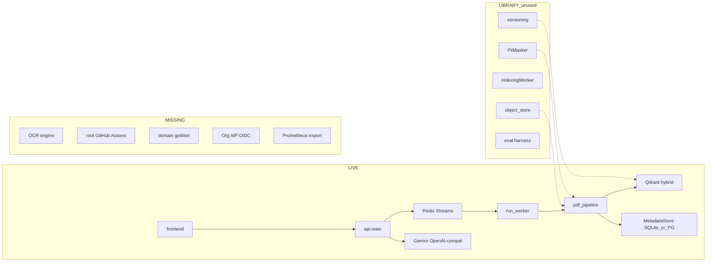
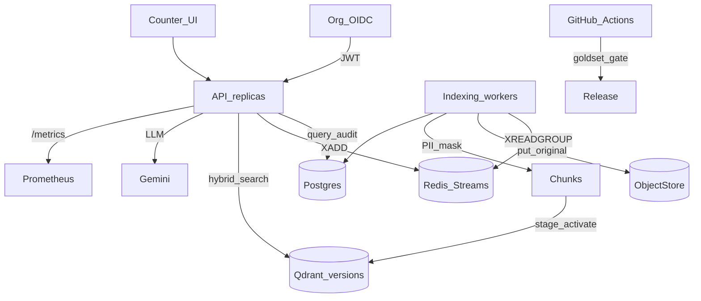

# 전체 시스템 고도화 설계

> 건강보험 문서 RAG MVP를 창구·소규모 기관 운영 수준으로 끌어올리기 위한 설계·구현 기록.
> 기준일: 2026-07. 진실원: 본 문서 + [REMAINING_WORK.md](../REMAINING_WORK.md) + [README.md](../README.md).

## 개요

이미 있는 라이브러리(object store·versioning·PII·audit·eval)를 라이브 경로에 연결하고, 품질 게이트·감사·내구성·인증을 90일 기준으로 단계 구축한다.

| Phase | 내용 | 상태 |
|-------|------|------|
| 0 | 도메인 골드셋 + root CI + 문서 정합 | 구현 완료 |
| 1 | PII · query audit · /metrics · 일일 예산 · Counter UX | 구현 완료 |
| 2 | Object store · versioning · HWPX 동결 · OCR go/no-go | 구현 완료 |
| 3 | OIDC · dept ACL · ops compose | 구현 완료 |
| 4 | SLO · TEI/K8s 골격 · injection red-team · 레포 위생 | 구현 완료 |

---

## 전제 (고정)

- **목표 사용자**: 내부 창구 / 소규모 기관 (수십 동시 사용자, 문서 수 GB 단위). 풀 멀티테넌트 SaaS·대규모 K8s는 Phase 4 이후.
- **원칙**: 새 프레임워크를 쓰지 않고 [`src/harag/`](../src/harag/)에 이미 있는 어댑터를 **라이브 배선**한다. 한국어 스냅샷 폴더는 설계 아카이브로 두고 런타임에서 제외한다.
- **문서 정책**: HWP는 **HWPX 우선**, 바이너리 HWP는 텍스트+표 게이트; 스캔 PDF는 Phase 2까지 **제품상 거부(명확 에러)** 유지 후 OCR 도입 여부 결정.
- **문서 기준**: [REMAINING_WORK.md](../REMAINING_WORK.md) + [README.md](../README.md)를 진실원으로 삼고, `앞으로 해야 할 것들/PRODUCTION_ROADMAP.md`의 “어댑터 전부 fake” 서술은 폐기한다.

---

## 설계 시점 상태 요약 (As-Is)



| 영역 | LIVE (설계 전) | LIBRARY / PARTIAL | MISSING (설계 전) |
|------|----------------|-------------------|-------------------|
| 인제스트 | Redis Streams + `run_worker` + spool | `IndexingWorker`, `object_store`, `versioning` | — |
| 파싱 | PDF/HWPX/DOCX/HWP5 텍스트, `.doc` LibreOffice | HWP5 표 B3 | OCR |
| 검색·생성 | hybrid RRF, citations, SSE, capacity | HttpCrossEncoder(조건부) | 도메인 골드셋 CI |
| 보안 | JWT verify, owner ACL, injection regex | `PiiMasker` 미배선 | OIDC, dept/role 태그 |
| 감사·관측 | upload/delete audit, QueryTrace 로그 | `MetricsCollector` 미사용 | query audit, `/metrics` |
| 운영 | compose: qdrant/redis/api/worker | postgres profile | root CI, MinIO, secrets manager |

**주의**: `REMAINING_WORK.md` B.P1#2 “큐+IndexingWorker 라이브 미배선”은 절반만 맞음 — **큐는 LIVE**, 갭은 library `IndexingWorker`+원본보존+버전 전환 패턴이다.

---

## 목표 아키텍처 (To-Be)



핵심 변화 4가지:

1. **품질이 릴리즈를 막는다** — 층화 골드셋 + root CI
2. **원본이 살아 있다** — spool 삭제 전 ObjectStore 보존 → 재인덱싱·감사 가능
3. **질의가 감사된다** — who / what / citations / abstain / egress
4. **신원이 조직 단위다** — OIDC JWT + 문서 dept/role 태그

---

## Phase 0 — 품질 기반 (2주): “측정 없으면 고도화 없음”

### 0.1 도메인 골드셋

- 위치: [`eval/goldsets/`](../eval/goldsets/) (설계 전: `rerank_sample.json` 2건뿐)
- 층화 최소 세트:
  - PDF 본문 / 표 / 다중근거 / 근거없음(abstain)
  - HWPX 표·본문
  - HWP5 텍스트 (표는 `partial` 기대 케이스 별도)
  - DOCX
  - 충돌 문서(구버전 vs 신버전) 2–3건
- 라벨: `query`, `must_cite_chunk_ids` 또는 `page+struct_path`, `abstain`, `forbidden_claims`
- 하네스: [`src/harag/eval/quality.py`](../src/harag/eval/quality.py), [`harness.py`](../src/harag/eval/harness.py), [`run_quality_gate.py`](../src/harag/eval/run_quality_gate.py)
- [`scripts/eval_accuracy.py`](../scripts/eval_accuracy.py)의 영문 synthetic은 **회귀 smoke**로 유지하고 도메인 게이트와 분리

**구현**: `domain_health_insurance_v1.json` + 합성 outputs + `python -m harag.eval.run_quality_gate`

### 0.2 Root CI

- [`.github/workflows/ci.yml`](../.github/workflows/ci.yml): pytest + 오프라인 quality gate + docker build
- [`.github/workflows/quality-gates.yml`](../.github/workflows/quality-gates.yml): 야간/수동 골드셋·측정 방법론
- 임계는 [`scripts/poc_format_gate.py`](../scripts/poc_format_gate.py) + [ADR-HWP5](adr/ADR-HWP5.md)의 `PARSE_MIN_TABLE_RECOVERY`와 맞춤

### 0.3 문서 정합

- `REMAINING_WORK.md` P1#2를 “Redis Streams LIVE / library IndexingWorker·object_store·versioning 미배선”으로 수정
- 본 문서를 고도화 설계 고정본으로 유지

**완료 기준**: PR마다 단위테스트 통과; 주 1회 도메인 골드셋 리포트 산출.

---

## Phase 1 — 창구 운영 안전 (3–4주): PII · 감사 · 비용 · UX

### 1.1 라이브 PII 마스킹

- [`src/harag/security/pii.py`](../src/harag/security/pii.py)의 `PiiMasker`를 [`pdf_pipeline.py`](../src/harag/indexing/pdf_pipeline.py) / [`run_worker.py`](../src/harag/indexing/run_worker.py) 청크 생성 직전 주입
- 설정: `PII_MASK_ENABLED=true` (운영 기본 on)
- 질의 로그: `QueryTrace`에 mask 콜백 — raw query가 로그에 남지 않게

### 1.2 질의 audit (규제·분쟁 대응)

- `MetadataStore.log_audit`를 upload/delete만이 아니라 [`api/pipeline.py`](../src/harag/api/pipeline.py)에서 호출
- 이벤트 스키마:
  - `event=query|abstain|error`
  - `user_id`, `trace_id`
  - `citation_chunk_ids[]`, `doc_ids[]`
  - `token_estimate`, `latency_ms`
  - `query_redacted` (PII 마스킹 후)
- 운영은 Postgres 권장 (`--profile postgres` / `--profile ops`); SQLite는 단일 인스턴스 데모만

### 1.3 메트릭 export

- `MetricsCollector` + egress를 파이프라인에 연결 ([`metrics_export.py`](../src/harag/observability/metrics_export.py))
- `GET /metrics` (Prometheus text): abstention rate, stage p95, LLM egress tokens
- 알림 기준(초안): Qdrant disk >80%, Redis consumer lag, Gemini daily token budget breach

### 1.4 Gemini 일일 예산 강제

- [`docs/GEMINI_COST_STRATEGY.md`](GEMINI_COST_STRATEGY.md) + [`scripts/gemini_quota_budget.py`](../scripts/gemini_quota_budget.py)를 런타임 가드로 승격
- QPM에 더해 `DAILY_QUESTION_BUDGET` / `DAILY_TOKEN_BUDGET` ([`daily_budget.py`](../src/harag/api/daily_budget.py)) → 초과 시 `budget_exhausted`

### 1.5 Counter UX 잔여

- [COUNTER_UX.md](COUNTER_UX.md): 업로드 전 **HWPX 권장** 안내; JWT는 `sessionStorage` 우선; “법적 판단 불가” 스태프 문구 고정
- 포맷 실패 코드는 예방 카피로 전환

**완료 기준**: 질의 1건 = audit 1행; PII 샘플이 인덱스에 평문 잔존하지 않음; 일일 예산 초과 시 API 거부.

---

## Phase 2 — 내구성·재처리 (3–4주): Object Store · Versioning · HWP 표

### 2.1 원본 Object Store 배선

- 인터페이스 [`storage/object_store.py`](../src/harag/storage/object_store.py) + [`object_store_factory.py`](../src/harag/storage/object_store_factory.py)
- compose `--profile minio` / `--profile ops`
- 라이브 흐름: upload → spool → **put original** → parse/embed → spool 삭제, object key를 metadata에 저장
- 재인덱싱: `POST /v1/documents/{id}/reindex`

### 2.2 Blue-green versioning 라이브화

- [`indexing/versioning.py`](../src/harag/indexing/versioning.py) + [`version_coord.py`](../src/harag/indexing/version_coord.py)
- stage → activate → GC; 메타 `active_version` 기록
- Qdrant는 `replace_document`와 병행 (검색은 최신 활성)

### 2.3 HWP5 표 (B3) 또는 정책 동결

- 기본값: 게이트 미달 시 **기관 SOP: HWP→HWPX 필수**, 바이너리 HWP는 텍스트-only + UI `hwp5_table_limited` 유지
- ADR: [ADR-HWP5.md](adr/ADR-HWP5.md) 정책 동결 조항

### 2.4 OCR 결정 게이트

- [OCR_POLICY.md](OCR_POLICY.md) + [`ocr_policy.decide_ocr`](../src/harag/parsing/ocr_policy.py)
- 스캔 &lt;15% → 제품 거부 유지 + 변환 SOP
- ≥15% → OCR 어댑터 도입 권고 (골드셋 scan strata 후 merge)

**완료 기준**: 원본 key로 재인덱싱 가능; 버전 전환 실패가 검색을 깨지 않음; HWP 정책이 ADR+UI+게이트에 동일.

---

## Phase 3 — 조직 신원·ACL (2–3주)

### 3.1 OIDC → 기존 IdentityProvider

- [`api/auth.py`](../src/harag/api/auth.py) / [`auth_jwt.py`](../src/harag/api/auth_jwt.py) / [`auth_oidc.py`](../src/harag/api/auth_oidc.py)
- `OidcJwtIdentityProvider`: JWKS, `iss`/`aud`, 클레임 매핑 (`sub`→user, `groups`/`dept`→tags)
- 데모 `X-Owner-Id`는 `AUTH_ALLOW_DEMO_OWNER=false`로 운영 차단

### 3.2 문서 태깅·검색 필터

- 인제스트 시 chunk payload: `owner`, `dept`, `roles[]`, `acl_mode`
- Qdrant filter와 metadata `list_for_acl` 정합
- 공유 부서 문서: 업로더 ≠ 검색자여도 dept 일치 시 목록 허용

### 3.3 시크릿·배포 최소선

- [SECRETS_OPS.md](SECRETS_OPS.md)
- 운영 compose: `api+worker+qdrant+redis+postgres+minio` (`--profile ops`)

**완료 기준**: 데모 헤더로 타인 문서 접근 불가(운영 모드); dept 공유 시나리오 지원.

---

## Phase 4 — 성능·규모 (이후, 필요 시)

| 항목 | 내용 | 트리거 | 구현 |
|------|------|--------|------|
| Load/SLO | [`eval/perf.py`](../src/harag/eval/perf.py), [`eval/slo.yaml`](../eval/slo.yaml) | 동시 창구 >10 | SLO 초안 동결 |
| Self-host embed/rerank | TEI + `RERANKER_SERVER_URL` | API 비용·지연 한도 초과 | compose `--profile tei` |
| API/Worker HPA | K8s + shared PG/Redis/MinIO/Qdrant | 다중 AZ | [`deploy/k8s/`](../deploy/k8s/) |
| Injection red-team | KR 행정문서 인젝션 세트 | 외부 업로드 허용 시 | `tests/behavior/test_injection_redteam.py` |
| 레포 위생 | 아카이브 분리 가이드 | clone 비용 | [REPO_HYGIENE.md](REPO_HYGIENE.md) |

---

## 스프린트 순서 (90일 한 장)

| 주차 | 산출물 |
|------|--------|
| 1–2 | 골드셋 v1 + root CI + REMAINING_WORK 정합 |
| 3–4 | PII 라이브 + query audit + /metrics |
| 5–6 | Gemini daily budget + Counter UX 잔여 |
| 7–9 | MinIO 원본 + versioning 라이브 |
| 10–11 | HWP 표 PoC 또는 HWPX-only 동결 + OCR go/no-go |
| 12–13 | OIDC + dept ACL + secrets 프로파일 |
| 14+ | SLO/load, GPU rerank (데이터 보고 결정) |

---

## 구현 시 건드릴 핵심 파일

| 작업 | 파일 |
|------|------|
| PII·원본·버전 | `pdf_pipeline.py`, `run_worker.py`, `object_store.py`, `versioning.py`, `version_coord.py` |
| Audit·metrics | `pipeline.py`, `metadata_store.py`, `tracing.py`, `metrics_export.py`, `main.py` |
| Auth/ACL | `auth.py`, `auth_jwt.py`, `auth_oidc.py`, ingest payload 태그 |
| 품질 | `eval/goldsets/`, `.github/workflows/`, `run_quality_gate.py` |
| Ops | `docker-compose.yml`, `.env.example`, `deploy/k8s/` |
| 정책 문서 | ADR-HWP5, OCR_POLICY, GEMINI_COST_STRATEGY, COUNTER_UX, REMAINING_WORK, SECRETS_OPS |

---

## 성공 지표 (제품 SLO 초안)

- **정확도**: 도메인 골드셋 citation hit ≥ 합의 임계; abstain 문항에서 환각 ≤ 합의 임계 (`eval/slo.yaml`)
- **안전**: PII 평문 인덱스 샘플 0; query audit 커버리지 100%
- **비용**: 일일 예산 초과 시 자동 차단; egress 토큰 일별 가시화 (`/metrics`)
- **내구성**: 원본 object 존재율 100% (ready 문서, ObjectStore 활성 시); 버전 롤백 가능
- **가용**: `/health` + redis lag + qdrant capacity

---

## 다시 만들지 말 것

- Redis Streams 큐 (이미 LIVE)
- hybrid RRF / structured citations / delete API / Counter UX 골격
- 가짜 어댑터 전면 교체 — **배선·게이트·운영**이 본업

---

## 리스크와 대응

| 리스크 | 대응 |
|--------|------|
| HWP 표에 무한 공수 | 2주 PoC + 게이트 실패 시 HWPX SOP 동결 |
| 골드셋 라벨링 병목 | 창구 FAQ 상위 30질의를 먼저 층화 |
| 외부 LLM 법무 | Phase 1에 egress audit; 유료/학습비사용 티어 체크리스트 |
| SQLite 다중 인스턴스 | 운영은 Postgres (`--profile ops`) |
| 레포 아카이브 비대 | REPO_HYGIENE; 런타임 import 금지 유지 |

---

## 런타임 환경 변수 (고도화 추가분)

| 변수 | 기본 | 설명 |
|------|------|------|
| `PII_MASK_ENABLED` | `true` | 인제스트·질의 로그 PII 마스킹 |
| `DAILY_QUESTION_BUDGET` | `0` (off) | 일일 질문 상한 |
| `DAILY_TOKEN_BUDGET` | `0` (off) | 일일 토큰 상한 |
| `OBJECT_STORE_ENDPOINT` 등 | 비움 | MinIO/S3 원본 보존 |
| `AUTH_OIDC_JWKS_URL` | 비움 | OIDC JWKS 검증 |
| `AUTH_ALLOW_DEMO_OWNER` | `true` | 운영은 `false` |
| `OCR_SCAN_RATIO_THRESHOLD` | `0.15` | OCR 도입 go/no-go |

상세: [`.env.example`](../.env.example), [SECRETS_OPS.md](SECRETS_OPS.md).

---

## 운영 명령 요약

```bash
# 품질 게이트
PYTHONPATH=src python -m harag.eval.run_quality_gate

# 기본 MVP
docker compose up --build

# 운영 로컬 (Postgres + MinIO)
docker compose --profile ops up --build

# TEI 리랭커(선택)
docker compose --profile tei up -d
```

---

## 관련 문서

- [REMAINING_WORK.md](../REMAINING_WORK.md)
- [ADR-HWP5.md](adr/ADR-HWP5.md)
- [OCR_POLICY.md](OCR_POLICY.md)
- [COUNTER_UX.md](COUNTER_UX.md)
- [GEMINI_COST_STRATEGY.md](GEMINI_COST_STRATEGY.md)
- [SECRETS_OPS.md](SECRETS_OPS.md)
- [REPO_HYGIENE.md](REPO_HYGIENE.md)
- [eval/slo.yaml](../eval/slo.yaml)
- [deploy/k8s/README.md](../deploy/k8s/README.md)
